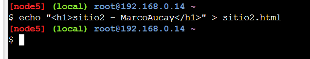

## Título
                           **Crear y Configurar dos contenedores Nginx utilizando Docker.**

## Tiempo de duración
Esta practica tuvo una duracion de unos 70 minutos.

## Fundamentos
Los contenedores Docker han cambiado la forma en que se desarrollan, prueban y distribuyen aplicaciones y servicios. Un contenedor es un paquete que se ejecuta una aplicación y todas sus dependencias, lo que significa que siempre se ejecutará de la misma manera, incluso en diferentes entornos. En esta práctica, vamos a trabajar con Nginx, uno de los servidores web más utilizados. Nginx se puede utilizar como servidor web para servir contenido estático y como proxy inverso. Al usar contenedores Docker, es fácil levantar un servidor Nginx sin necesidad de la configuración manual del sistema host. Los contenedores en Docker son livianos y son fáciles de operar debido al concepto de “todo es un archivo”. Al igual que en el caso de los archivos Nginx, porque en un archivo de contenedor, schema puede escuchar volúmenes, los archivos pueden ser desde el archivo del sistema operativo host al contenedor. Esto hará que sea mucho más fácil para el operador manipular los archivos directamente desde el sistema de host y ver los cambios en tiempo real en el contenedor.

Un ejemplo común sería servir contenido web estático utilizando Nginx desde Docker. Mapeamos un montón archivos HTML desde el sistema del host a un contenedor Nginx, y luego hacemos que simplemente sirva ese contenido en un entorno aislado. En esta práctica, específicamente vamos a implementar 2 servidores Nginx, cada uno sirviendo uno diferente archivo HTML con el nombre del estudiante. Cuando Docker se convirtió en popular, realmente redujo el dolor de administrar servidores web. Antes, hacer que un Nginx funcione en un sistema operativo implicaba instalar dependencias, administrar el archivo de configuración y encontrar versiones que funcionen juntas. Minecraft convierte a la mayoría de ellos en inexistentes porque empaqueta todo en una imagen de contenedor terminada.

Play with Docker es una plataforma que permite a los usuarios ejecutar contenedores sin la necesidad de instalar Docker en su computadora. Es un buen lugar para realizar experimentos con contenedores y jugar con imágenes Docker. Con PWD, los usuarios pueden ejecutar comandos Docker en línea y lanzar un contenedor temporal para ejecutar rápidamente todos los contenedores de prueba. En esta práctica, creamos dos contenedores con Nginx que muestra un mensaje simple con el nombre del estudiante. Docker es una plataforma que permite a los desarrolladores empaquetar y distribuir aplicaciones en contenedores. Un contenedor es un espacio aislado que incluye todo lo que una aplicación necesita para ejecutarla. Nginx es un servidor web avanzado utilizado para servir contenido estático, actuar como servidor de proxy inverso y mucho más.
---

## Conocimientos previos
Para realizar esta practica tube que tener conocimientos de:

- **Comandos basicos Linux**: especialmente los relacionados con la gestión de archivos y directorios (`ls`, `mkdir`, `mv`, `pwd`, `echo`).

---

##  Objetivos a alcanzar
- Implementar dos contenedores con Nginx que sirvan como sitios web simples.
- Manipular archivos de configuración y contenido HTML para desplegar dentro de los contenedores.
- Utilizar Docker para mapear archivos del host al contenedor.

---

## Equipo necesario
- laptop con coneccion a Internet
- Acceso a [Docker Playground](https://labs.play-with-docker.com/)

---

## Material de apoyo
- Documentación oficial de Docker 
- 
- 

---

## Procedimiento

**Paso 1:** Acceder a Docker Playground con mi cuenta de Google y crear una nueva instancia 
                                                                                             

**Paso 2:** Crear un archivo HTML para el primer sitio web:

    **COMANDO UTILIZADO**

           echo "<h1>sitio1 - AndresAucay</h1>" > sitio1.html

                                                                                             

**Paso 3:** Crear otro archivo HTML para el segundo sitio web:      

     ***COMANDO UTILIZADO***

            echo "<h1>sitio2 - MarcoAucay</h1>" > sitio2.html

                                                                                             

**Paso 4:** Crear dos directorios diferentes para cada archivo html:

     ***COMANDOS UTILIZADOS***
           
            mkdir sitio1
            mkdir sitio2

                                                                                                         

**Paso 5:** Mover cada archivo html dentro de su carpeta:

     ***COMANDOS UTILIZADOS***

            mv sitio1.html sitio1/index.html
            mv sitio2.html sitio2/index.html

                                                                                             

**Paso 6:** Crear el primer contenedor:
 
     ***COMANDOS UTILIZADOS***

            docker run --name andresAucay -d -p 8089:80 -v $(pwd)/sitio1:/usr/share/nginx/html nginx

**Paso 7:** Crear el segundo contenedor:

            ***COMANDOS UTILIZADOS***

            docker run --name Aucay -d -p 8081:80 -v $(pwd)/sitio2:/usr/share/nginx/html nginx

*******se cambia el puerto para que no haya errores*****

                                                                                              

**Paso 8:** Verificar que los contenedores esten creados y esten corriendo :

      ***COMANDOS UTILIZADOS***

            docker ps

                                                                                             

**Paso 9:** Visualizar el sitio 1:

                                                                                             

**Paso 10:** Visualizar el sitio 2:

## Resultados esperados 

Los dos contenedores Nginx estan sirviendo dos sitios web diferentes, uno en el puerto 8089 y otro en el 8081. Cada sitio muestra mi primer y segundo nombre respectivamente. A continuación se incluyen capturas de pantalla de los sitios web:

**Sitio web 1**
   

**Sitio web 2**
        

## Bibliografia 
   Docker Inc. (2024). Docker Documentation. Recuperado de https://docs.docker.com/
   Apellido, N. (2024). Guía de administración de servidores Nginx.
   Play with Docker. (2024). Play with Docker Documentation. Retrieved from https://labs.play-with-docker.com