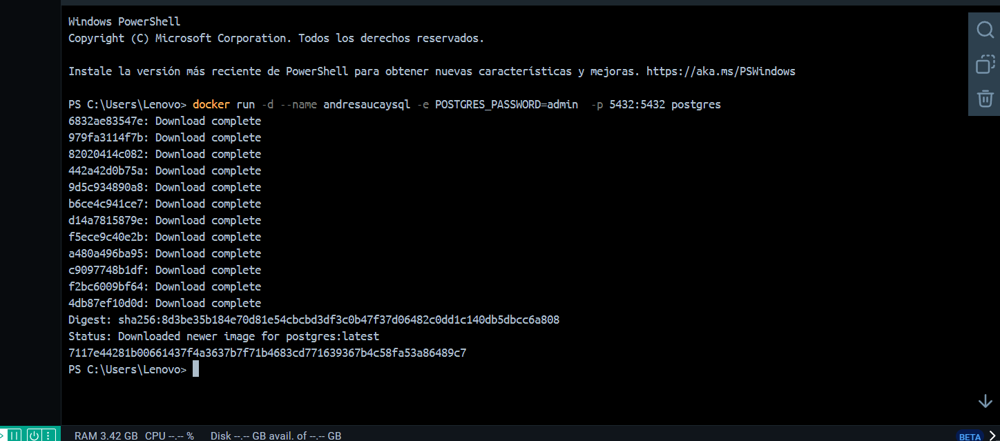
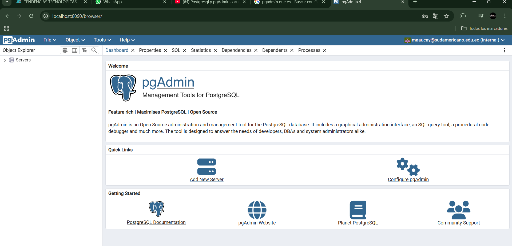
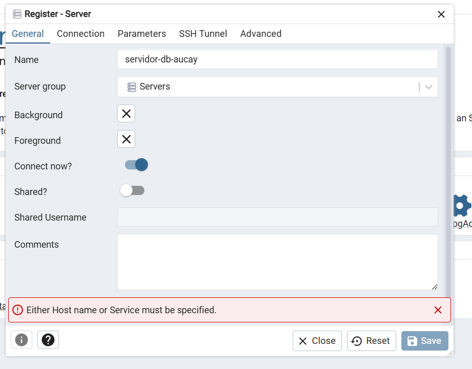
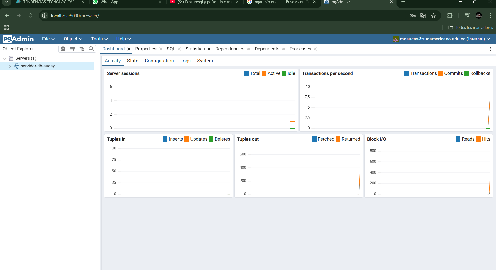
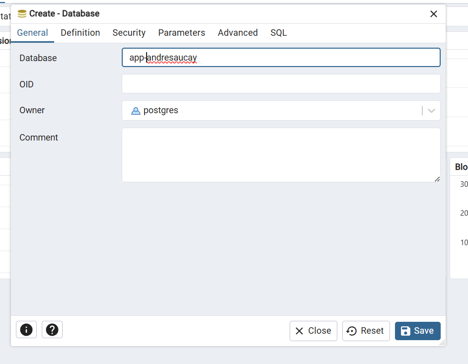

## Título
                           Creacion y conexion dos contenedores que se comuniquen entre si a traves de una red.

## Tiempo de duración
Esta practica tuvo una duracion de unos 85 minutos.

## Fundamentos
 #### PgAdmin es una herramienta de administración y desarrollo diseñada para facilitar el trabajo con bases de datos PostgreSQL, brindando a los usuarios una interfaz gráfica fácil de usar. Esto permite realizar tareas que van desde consultas básicas hasta configuraciones avanzadas de permisos, sin necesidad de conocimientos profundos de SQL. Gracias a su carácter de código abierto y su compatibilidad con sistemas operativos como Windows, macOS y Linux, pgAdmin se adapta tanto a proyectos pequeños como a grandes infraestructuras empresariales. Su versatilidad lo convierte en una opción ideal para gestionar múltiples bases de datos en una misma plataforma, lo que permite a los administradores optimizar su tiempo al poder realizar análisis, monitoreo y ajustes desde una única herramienta. Además, su integración con navegadores web hace que su acceso sea sencillo y remoto, abriendo posibilidades para equipos distribuidos o trabajo colaborativo.

#### PostgreSQL es una base de datos relacional de código abierto que se destaca por su confiabilidad, flexibilidad y compatibilidad con estándares técnicos. A diferencia de otros sistemas de gestión de bases de datos (RDBMS), PostgreSQL admite tanto tipos de datos relacionales como no relacionales, lo que la hace una opción versátil y robusta para diversas aplicaciones.                                                                                                                                                                                                                                                                        Originalmente desarrollada en 1986 como sucesora de INGRES por el profesor Michael Stonebraker, PostgreSQL evolucionó rápidamente, integrando soporte para SQL en 1994. Hoy, es mantenida por una comunidad internacional que continúa mejorándola, asegurando que se mantenga libre de licencias y de ataduras con proveedores.                                                                                                                                                                                                                                                                                    Algunas de las principales ventajas de PostgreSQL incluyen su capacidad para soportar altos niveles de concurrencia mediante MVCC (Control de concurrencia de múltiples versiones), lo cual evita conflictos de acceso cuando varios usuarios interactúan simultáneamente con la base de datos. También es altamente escalable y compatible con múltiples lenguajes de programación, lo que facilita su integración en infraestructuras locales y en la nube. Además, su arquitectura de código abierto brinda flexibilidad y reduce costos, lo que la convierte en una opción preferida para empresas que requieren continuidad del negocio y alta disponibilidad en sus servicios.

## Conocimientos previos
Para realizar esta practica requeria tener conocimientos de:

- **Comandos de Docker**

---

##  Objetivos a alcanzar
- Configurar y ejecutar dos contenedores Docker de manera independiente: uno para la base de datos PostgreSQL y otro para pgAdmin 

- Crear una red  en Docker para permitir la comunicación entre ambos contenedores.

- Comprobar el acceso y correcto funcionamiento de pgAdmin al conectarse al contenedor de PostgreSQL.

- Realizar pruebas de funcionamiento mediante la creación de una base de datos y una tabla.

---

## Equipo necesario
- laptop con conexion a Internet
- Docker Desktop instalado localmente 

---

## Material de apoyo
- Documentación oficial de Docker 
- Tutorial de Youtube "https://www.youtube.com/watch?v=F_aL2Aw5wcE"

---

## Procedimiento

**Paso 1:** Acceder a Docker Desktop en la computadora

**Paso 2:** Descargar y ejecutar el contenedor de postgres (andresaucaysql):

    **COMANDO UTILIZADO**

           docker run -d --name andresaucaysql -e POSTGRES_PASSWORD=admin  -p 5432:5432 postgres

                                                                                             

**Paso 3:**  Descargar y ejecutar el contenedor de PGadmin (andresaucay_pgadmin):

      ***COMANDO UTILIZADO***

            docker run -d --name andresaucay_pgadmin -p 8090:80 -e PGADMIN_DEFAULT_EMAIL=maaucay@sudamericano.edu.ec -e PGADMIN_DEFAULT_PASSWORD=admin dpage/pgadmin4

                                                                                             

**Paso 4:** Verificar que los dos contenedores creados anteriormente se esten ejecutando

     ***COMANDOS UTILIZADOS***
           
            docker ps

                                                                                                         

**Paso 5:** Crear la red (redandres_aucay)

     ***COMANDOS UTILIZADOS***

           docker network create --attachable redandres_aucay

                                                                                             

**Paso 6:** Identificar y agregar el contenedor postgres (andresaucaysql) a la red creada:
 
     ***COMANDOS UTILIZADOS***
     
     docker network connect redandres_aucay andresaucaysql

                                                                                                        

**Paso 7:** Identificar y agregar el contenedor PGadmin (andresaucay_pgadmin) a la red creada:
 
     ***COMANDOS UTILIZADOS***
     
        docker network connect redandres_aucay andresaucay_pgadmin

                                                                                                                        
**Paso 8:** Verificar que el contenedor PGadmin este funcionando en el puerto 8090:

            ***COMANDOS UTILIZADOS***
                    localhost:8090

                                                                                              

**Paso 9:** Acceder al panel de administracion de PGadmin:

      ***Uso las credenciales creadas***

                                                                                             

**Paso 10:** Enlazar al contenedor de Postgres:

         ***Uso el nombre del contenedor postgres (andresaucaysql)***

                                                                                             

**Paso 11:** Crear una base de datos:

                                                                                                            

**Paso 11:** Crear una tabla para verificar que se creo la base de datos correctamente:

                                                                                                            

## Resultados esperados 
- Creación exitosa de los contenedores PostgreSQL y pgAdmin, ambos en ejecución y accesibles en Docker Desktop.

- Configuración de la red  en Docker, asegurando la conectividad entre los contenedores para permitir la interacción de pgAdmin con PostgreSQL.

- Acceso al panel de administración de pgAdmin en el puerto 8090, mostrando la interfaz y permitiendo la gestión de bases de datos.

- Conexión satisfactoria a PostgreSQL desde pgAdmin, validada por la creación de una base de datos y una tabla que confirmen el éxito de la configuración de la red.

## Bibliografia 
   Docker Inc. (2024). Docker Documentation. Recuperado de https://docs.docker.com/

   Ibm. (2023, 2 octubre). ¿Qué es PostgreSQL?  | IBM. ¿Que es PostgreSQL? Recuperado 28 de octubre de 2024, de https://www.ibm.com/mx-es/topics/postgresql

   Ochobitshacenunbyte. (2017). pgAdmin, una plataforma para administrar y desarrollar con PostgreSQL. Recuperado de https://www.ochobitshacenunbyte.com/2017/11/21/pgadmin-una-plataforma-para-administrar-y-desarrollar-con-postgresql/