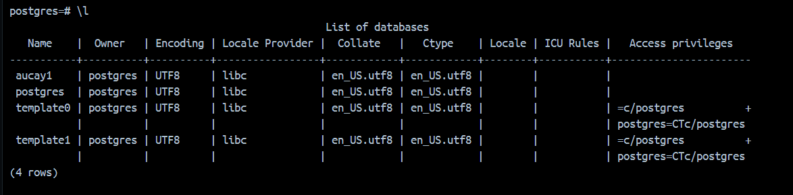

## Título
                           Practica volume

## Tiempo de duración
Esta practica tuvo una duracion de unos 50 minutos.

## Fundamentos

## Conocimientos previos

##  Objetivos a alcanzar
- Implementar dos contenedores uno sin volumen y otro con para verificar la persistencia de los datos

---

## Equipo necesario
- laptop con conexion a Internet
- Docker Desktop instalado localmente 

---

## Material de apoyo
- Documentación oficial de Docker 

---

## Procedimiento
Esta practica la estoy desarrollando en docker instalado localmente en mi maquina

# Parte 1

**Paso 1:** Creación de un contenedor de postgresql sin volumenes 
        
        **COMANDO UTILIZADO**

          docker run -d --name dbpsql_1 -e POSTGRES_PASSWORD=admin -p 5432:5432 postgres

                                                                                             

**Paso 2:** Acceder al contenedor para crear una base de datos::

    **COMANDO UTILIZADO**

           docker exec -it dbpsql_1 psql -U postgres

                                                                                             

**Paso 3:** Crear una base de datos       

     ***COMANDO UTILIZADO***

            CREATE DATABASE Aucay1;

                                                                                             
**Paso 3.1:** Verificar la base de datos      

     ***COMANDO UTILIZADO***

            \l

                                                                                             
**Paso 4:** Salir de la consola de Postgresql y regresar a la terminal de Docker:

     ***COMANDOS UTILIZADOS***
           
            \q

                                                                                                         

**Paso 5:** Detener el contenedor:

     ***COMANDOS UTILIZADOS***

            docker stop dbpsql_1

                                                                                             
**Paso 6:** volver a iniciar el contenedor:

     ***COMANDOS UTILIZADOS***

            docker start dbpsql_1

                                                                                             
**Paso 7:** Verificar que la base de datos no persiste:

     ***COMANDOS UTILIZADOS***

           docker exec -it dbpsql_1 psql -U postgres
       
              \l

##### La base de datos "Aucay1" ya no debria de existir 

                                                                                             

# Parte 2 
## Crear un contenedor PostgreSQL con volúmenes:

**Paso 8:** Crear un Volumen:

     ***COMANDOS UTILIZADOS***

            docker volume create db_aucay

                                                                                             
**Paso 9:** Ejecutar el contenedor PostgreSQL con persistencia:

     ***COMANDOS UTILIZADOS***

            docker run -d --name dbpsql_vol -e POSTGRES_PASSWORD=admin -v db_vol:/var/lib/postgresql/data -p 5433:5432 postgres

                                                                                             

**Paso 10:**Acceder al contenedor para crear la base de datos:
 
     ***COMANDOS UTILIZADOS***

            docker exec -it dbpsql_vol psql -U postgres

                                                                                                         
**Paso 11:** Crear la base de datos:

            ***COMANDOS UTILIZADOS***

            CREATE DATABASE Vol_Aucay2;

                                                                                              
**Paso 11.1:** Verificar la base de datos      

     ***COMANDO UTILIZADO***

            \l

**Paso 12:** Salir de la consola de Postgresql y regresar a la terminal de Docker:

     ***COMANDOS UTILIZADOS***
           
            \q

                                                                                                         

**Paso 13:** Detener el contenedor:

     ***COMANDOS UTILIZADOS***

            docker stop dbpsql_vol

                                                                                             
**Paso 14:** volver a iniciar el contenedor:

     ***COMANDOS UTILIZADOS***

            docker start dbpsql_vol

                                                                                             
**Paso 15:** Verificar que la base de datos persiste:

     ***COMANDOS UTILIZADOS***

           docker exec -it dbpsql_vol psql -U postgres
       
              \l

##### La base de datos "Vol_Aucay2" debria de existir todavia

## Resultados esperados 

- Contenedor PostgreSQL sin volúmenes:
Se creó la base de datos Aucay1, pero no persiste después de reiniciar el contenedor.

- Contenedor PostgreSQL con volúmenes:
Se creó la base de datos Vol_Aucay2, la cual sí persiste después de reiniciar el contenedor.

## Bibliografia 
   Docker Inc. (2024). Docker Documentation. Recuperado de https://docs.docker.com/

   Apellido, N. (2024). Guía de administración de servidores Nginx.

   Play with Docker. (2024). Play with Docker Documentation. Retrieved from https://labs.play-with-docker.com

